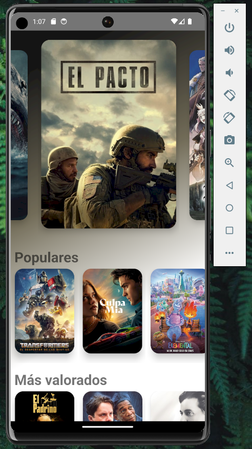
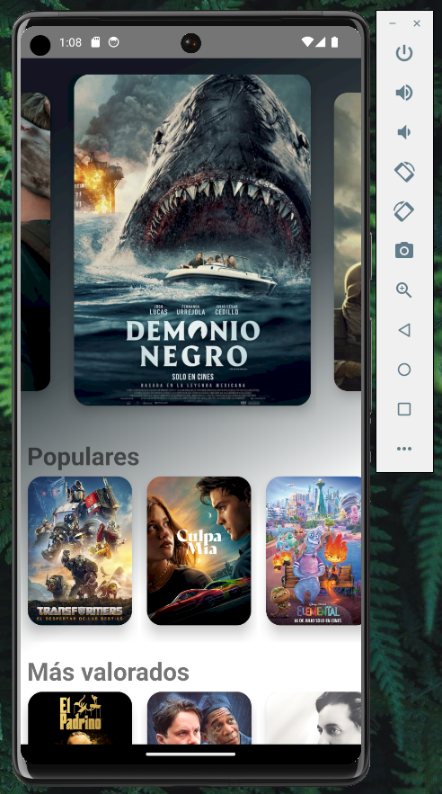
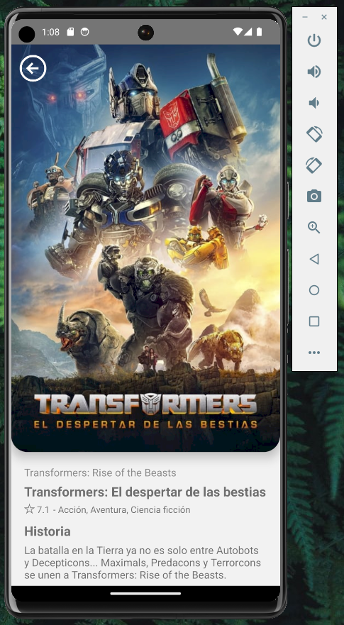
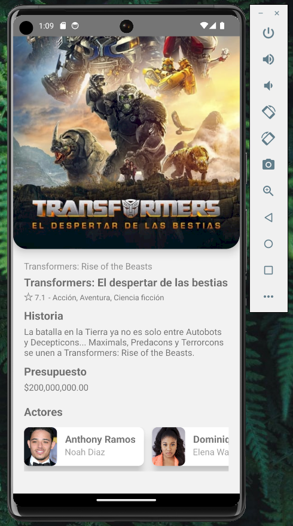

# **PELÍCULAS APP**

 

## **📌 OBJETIVOS**

- Desarrollar una aplicación para ver información sobre películas populares, más valoradas y próximos lanzamientos.
- Proporcionar la funcionalidad de ver el detalle de cada película, incluyendo descripción, valoración, género y elenco.

 

## **📌 DESCRIPCIÓN DEL PROYECTO**

La aplicación de Películas tiene como objetivo ofrecer a los usuarios la posibilidad de explorar y obtener información sobre películas populares, más valoradas y próximos lanzamientos. Con esta aplicación, los usuarios podrán:

✅ Ver una lista de películas populares para estar al tanto de las películas que están en tendencia.
 
✅ Explorar películas más valoradas para descubrir las películas con las mejores críticas y calificaciones.
 
✅ Conocer las películas próximas a lanzarse para estar al tanto de los próximos estrenos.
 
✅ Acceder al detalle de cada película para obtener información más detallada, como la descripción, valoración, género y elenco de la película.
 
 

## **🦾 TECNOLOGÍAS**

- **React Native**, **Typescript**.

 

## **📍 HOME**

 

 

 

## **📍 DETALLE**

 

 

 
